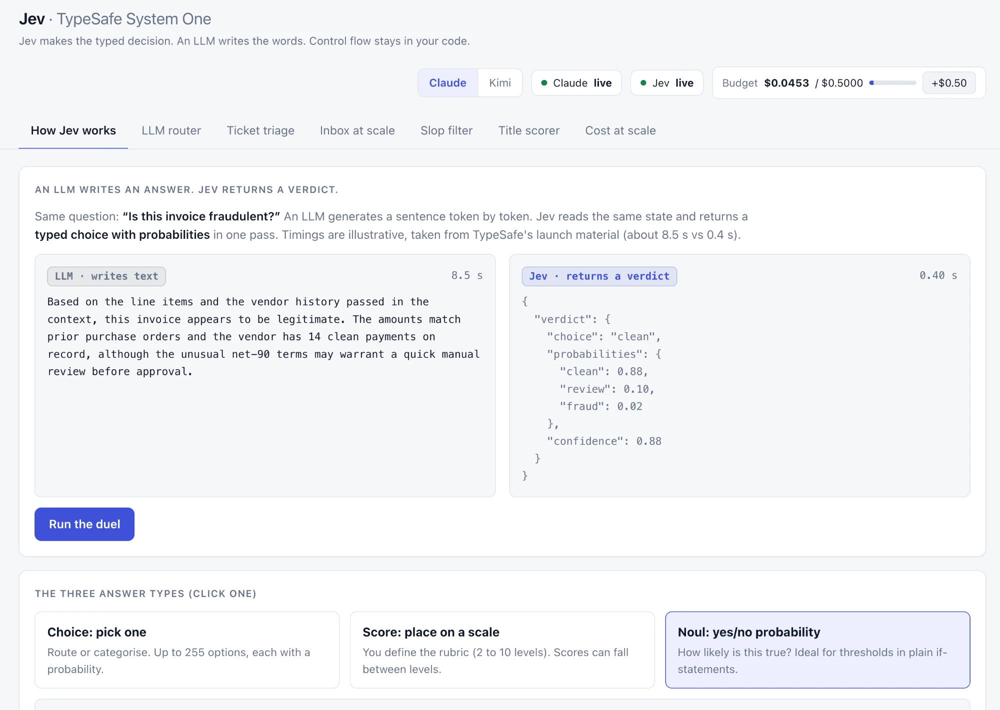

# Jev demos


Six live, side-by-side demos of [TypeSafe's Jev](https://www.langchain.com/blog/building-a-harness-with-jev) — a "System One" model that returns **typed, probabilistic decisions** (70–500 ms, $0.042 per 1M input tokens, output free) instead of generated text.

**Jev makes the decision. An LLM writes the words. Your code owns the control flow.** Switch the LLM side between **Claude** (Haiku 4.5 / Sonnet 5 / Opus 5) and **Kimi** (K2.6 / K3) from the header — every tab, price and pipeline label follows the switch.

Reference: https://www.linkedin.com/posts/atul-gupta-5434b513_typesafeai-softwareengineering-aiinproduction-activity-7509098124397830144-ZD_f?utm_source=share&utm_medium=member_desktop&rcm=ACoAAAK-P8MBuw_xSi568d9YJ3uXQqs1XhgRwxw




---

## Quickstart

```bash
git clone git@github.com:itsatgupta/Jev.git
cd Jev
npm install
cp .env.example .env    # optional — see "API keys" below
npm start
```

Open **http://localhost:3000**. That's it — no build step, no keys required to try it.

- **Node 22.6 or newer** is required (the app runs TypeScript directly via Node's native support — no compile step, no `ts-node`). Check with `node -v`.
- **No API keys needed to explore the UI.** Any demo whose key is missing runs in **simulated mode**: output is clearly badged `simulated` and a status pill in the header shows why. Add keys any time and reload — no restart needed for most changes, though the server does need a restart to pick up a newly added key.

---

## Demo mode (for presenting)

Flip the **Demo mode** switch in the header (or click **Start guided tour** on the homepage) and the app explains itself as it runs. The normal UI is untouched; demo mode only adds things on top:

- **Narrator bar.** A caption at the bottom narrates every step as it happens ("Jev answered 3 typed questions in 197 ms… only Haiku 4.5 is called, the other tiers cost $0…") with a step counter and a short log of the previous steps.
- **Spotlight.** The section being explained gets a highlight ring and is scrolled into view.
- **Demo guide cards.** Each tab gets a short "how to run this" card.
- **What to notice.** After each run, a callout summarises what the result means, using the real numbers from that run.
- **Guided tour.** A hands-off walkthrough of all six demos (about two minutes). Stop it any time.
- **Pace control.** Fast / Normal / Slow changes only the pauses between captions. Measured API latencies are never affected.

Tip for screenshots: the homepage has a **Clean view for screenshots** link (or open `/?shot=1`) that hides the header controls, leaving just the banner and content.

---

## API keys (all optional)

| Key | Powers | Get one at |
|---|---|---|
| `TYPESAFE_API_KEY` | Jev, the decision model — used in every demo | [typesafe.ai](https://typesafe.ai) |
| `ANTHROPIC_API_KEY` | Claude (Haiku 4.5 / Sonnet 5 / Opus 5) | [console.anthropic.com](https://console.anthropic.com/settings/keys) |
| `MOONSHOT_API_KEY` | Kimi (K2.6 / K3), the second LLM provider | [platform.kimi.ai](https://platform.kimi.ai) |

Put them in `.env` (copied from `.env.example`, already git-ignored — **never commit real keys**). You only need `TYPESAFE_API_KEY` plus **one** of the two LLM keys for a fully live demo; the app auto-selects whichever LLM provider is actually usable.

### Bring your own keys (in the browser)

You don't have to edit `.env` at all. Click **Add your keys** in the header (or **Use your own keys** on the homepage), paste your keys, and press **Save & test**. Each key is checked with a one-token call and you get a clear ✓ or ✕ per provider.

- Keys are held in this browser's `sessionStorage` and disappear when the tab closes. Tick **Remember on this device** to keep them in `localStorage` instead.
- They are sent to this app's server as request headers, used for that one request, and forwarded to the provider. The server never stores or logs them, redacts them from any error text, and keeps each visitor's keys isolated from everyone else's.
- Every key gets its **own spend cap** (`DEMO_BUDGET_USD`), so one visitor can never spend another's budget.
- Use a key with a low spend limit that you can revoke, and press **Clear keys** when you're done.
- If you host this over plain HTTP, keys travel unencrypted. **Always use HTTPS when hosting** (see below).

---

## The demos

| Tab | What it shows |
|---|---|
| **How Jev works** | Animated LLM-vs-Jev duel (illustrative timings) and the three answer types: choice, score, noul |
| **LLM router** | Jev reads a prompt and picks a model tier. Live pipeline diagram, race lanes vs. always using the top model, a confidence guard that escalates uncertain calls, and a 10-prompt benchmark |
| **Ticket triage** | One Jev call answers six questions about a support ticket; plain code routes it (discard / escalate / auto-reply). Optional real race against the small LLM as a classifier |
| **Inbox at scale** | Up to 500 emails classified in parallel — live donut chart, importance histogram, scam count, and cost per 1M emails. The LLM-classifier race is capped at 50 emails to keep it cheap; Jev still classifies the full set |
| **Slop filter** | Posts stream in and are labelled live (breaking / golden nugget / promo / hot take / noise / AI slop); a "hide slop" toggle cleans the feed in real time |
| **Title scorer** | The small LLM writes candidate video titles, Jev scores every one in parallel (click appeal, clarity, hype, specificity), and the leaderboard re-ranks live |
| **Cost at scale** | A slider showing monthly cost of Jev vs. every configured model at your volume |

---

## Keeping it cheap to run

- **Session budget.** `DEMO_BUDGET_USD` (default **$0.50**) is a hard cap on real LLM spend for the life of the server process. Once reached, paid LLM calls fall back to clearly badged simulated output — the header shows a live meter and a "+$0.50" button to raise it on the fly. Jev itself costs about $0.02–0.04 per 1,000 decisions and is never blocked by this cap.
- **Low effort/thinking everywhere.** Every demo call runs at the cheapest setting that still answers directly (thinking disabled on Kimi K2.6, low reasoning effort on K3, low effort on Claude), except the router's "frontier" tier and the always-top-model baseline, which need real capability to be a fair comparison.
- **Inbox race is capped at 50 emails** even if you pick 500 in the dropdown — only the head-to-head comparison is capped; Jev alone still classifies everything you asked for.
- **Simulated fallback.** If a key is missing, or a provider rejects the account (spend cap, no credit, bad key), that provider's output becomes clearly badged placeholder text and the header explains why. The other provider and Jev are unaffected. A capped provider automatically retries after 10 minutes, or immediately if you click its status pill in the header.

## Honest numbers

- **Failed baselines are never shown as results.** If an LLM comparison can't run, its lane simply says "unavailable" — nothing is faked or compared against it.
- Latencies in the race lanes are **measured API times**, not animation time. The "How Jev works" duel is the one illustrative exception (its timings come from TypeSafe's own launch material, not a live call).
- The router benchmark measures speed and cost, **not answer quality**. Read the actual answers on the harder prompts before concluding a cheaper tier matched a frontier model.
- Prices in [`src/config.ts`](src/config.ts) are first-party list prices as of September 2026 for [Anthropic](https://www.anthropic.com/pricing) and [Moonshot/Kimi](https://platform.kimi.ai/docs/pricing/chat) — re-check before quoting them anywhere else, list prices change.

---

## Hosting it publicly

The app is a single Node process with no database, so it runs anywhere Node 22.6+ does (a VPS, Railway, Fly.io, Render, a container). For a public deployment:

```bash
HOSTED=1 npm start
```

`HOSTED=1` makes the server **ignore its own API keys entirely**, so a public visitor can never spend your money: every visitor brings their own keys through the in-browser dialog, and without keys the demos run in clearly badged simulated mode. Also recommended:

- **Serve over HTTPS** (put it behind a reverse proxy or your platform's TLS). Visitors' keys are sent with each request.
- **Rate limiting** is on by default in hosted mode (600 requests per minute per IP). Tune it with `RATE_LIMIT_PER_MIN`. Behind a proxy, also set `TRUST_PROXY=1` so the real client IP is read from `X-Forwarded-For`.
- A **Content-Security-Policy** and other security headers are sent on every response. Everything is served from one origin; the only outbound calls are server-side to Anthropic, Moonshot and TypeSafe.
- Per-key budgets and provider health are held in memory, so they reset when the process restarts. That is fine for a demo; it is not a billing system.

### Deploy to Vercel

The repo is Vercel-ready: `public/` is served as static files and `api/[...path].ts` runs the same request handler as `npm start` as a serverless function (`vercel.json` sets a 60 s limit and the security headers).

1. Import the repo at [vercel.com/new](https://vercel.com/new) (framework preset **Other**, no build command).
2. Add environment variables: `HOSTED=1` and `TRUST_PROXY=1`. **Do not add your own API keys**; visitors bring theirs.
3. Deploy. Every push to `main` redeploys.

On serverless, in-memory state (per-key budgets, rate limits, provider health) is per function instance, so treat those limits as best-effort rather than exact.

---

## Project structure

```
src/
  keys.ts       per-request key context (bring-your-own-key), HOSTED mode, budget/health buckets
  config.ts     model IDs, prices, provider tiers, per-key spend budgets, provider availability
  llm.ts        Claude (Anthropic SDK) + Kimi (raw HTTP) behind one complete()/parseWith() API
  jev.ts        one typed Jev call, with latency, cost and budget tracking
  router.ts     the router demo's Jev questions + tier-selection logic
  triage.ts     the ticket-triage demo's Jev questions + routing rules
  usecases.ts   inbox classifier, slop filter, and title-scoring Jev questions
  samples.ts    sample prompts, tickets, feed posts, and the deterministic inbox generator
  server.ts     one HTTP endpoint per pipeline stage, so the UI can animate each hop live
public/
  index.html    the app shell: hero banner, six tabs, narrator bar, keys dialog
  app.js        per-demo UI logic, demo-mode cues, guided tour
  demo.js       demo-mode narration/pacing/callouts and the banner pixel field
  keys.js       browser-side key storage (sessionStorage / opt-in localStorage)
  flow.js       small animation toolkit: pipeline diagrams, race lanes, donut chart
  style.css     light/dark theme, single accent colour
  logo.png      the logo (banner and favicon)
docs/
  screenshot.png
```

## Scripts

| Command | Does |
|---|---|
| `npm start` | Run the server at `http://localhost:3000` |
| `npm run dev` | Same, but restarts on file changes (`node --watch`) |
| `npm run typecheck` | Type-check the whole project with `tsc --noEmit` |

## Troubleshooting

- **"Port 3000 already in use"** — set a different port: `PORT=3001 npm start`, or stop whatever else is using 3000.
- **A provider pill says "unavailable"** — the key is set but the account rejected the call (spend cap, no credit, wrong key). Click the pill to re-check immediately, or wait 10 minutes for the automatic retry.
- **A provider pill says "no key"** — that `.env` variable is empty or missing. Add it and restart the server.
- **`npm start` fails immediately** — check `node -v` is 22.6 or newer; older Node can't run `.ts` files directly.
- **My own key says "✕ The provider rejected this key"** — copy the whole key with no spaces, make sure it is active in the provider's console, and that it has credit. The check makes a real one-token call, so a key with a spend cap that is already reached also fails.
- **Everything is badged "simulated"** — no keys are set at all. The app still fully works for exploring the UI and flow; add at least `TYPESAFE_API_KEY` and one LLM key for live numbers.

## Contributing

This is a demo/reference project. Issues and pull requests are welcome — keep changes scoped and consistent with the existing style (plain TypeScript, no framework, no build step).

## License

[MIT](LICENSE) © 2026 Mayank Aggarwal
